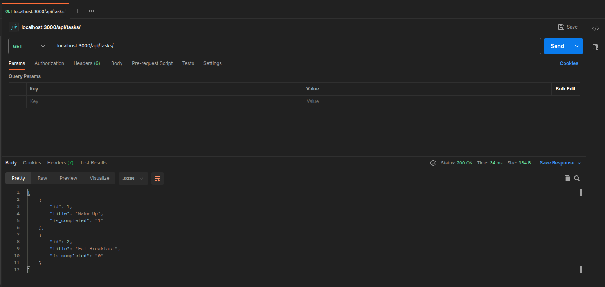
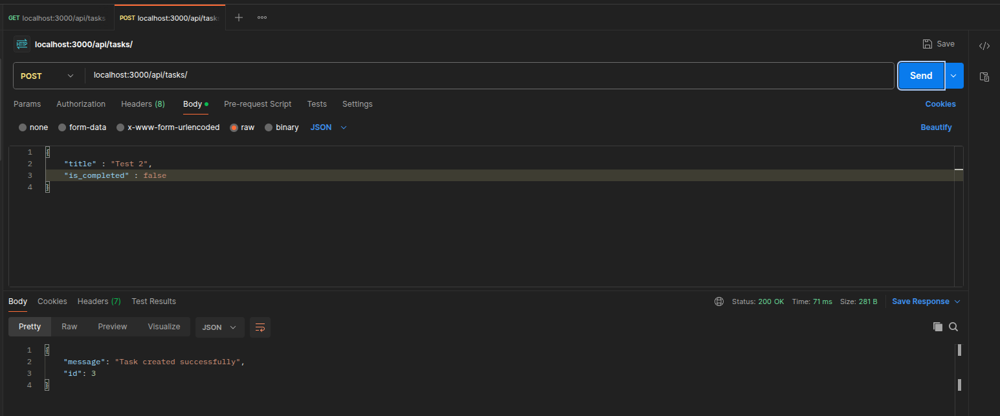
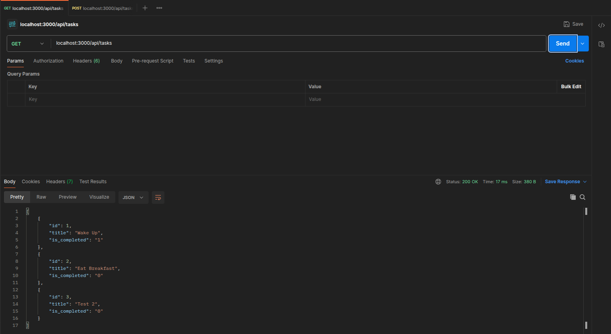
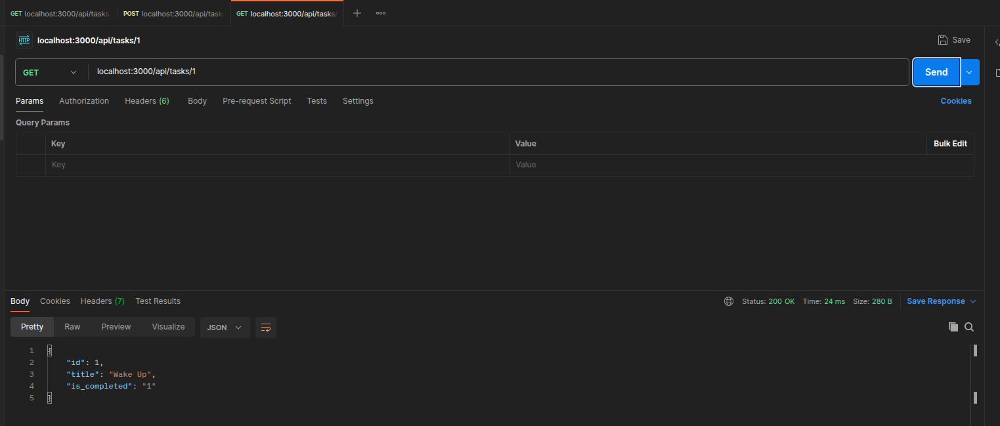
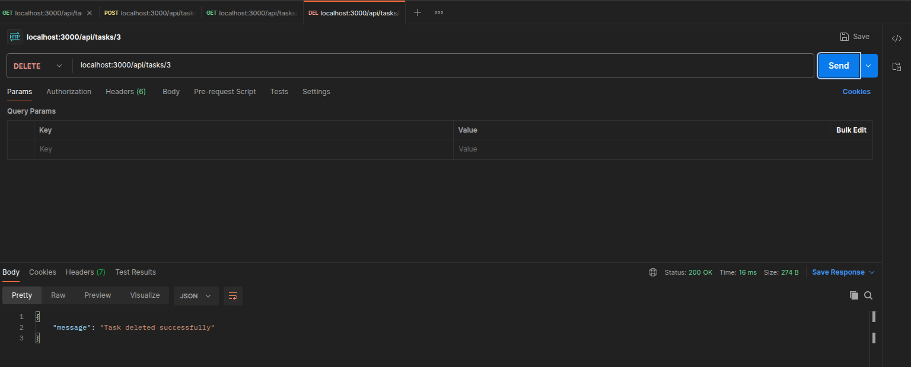
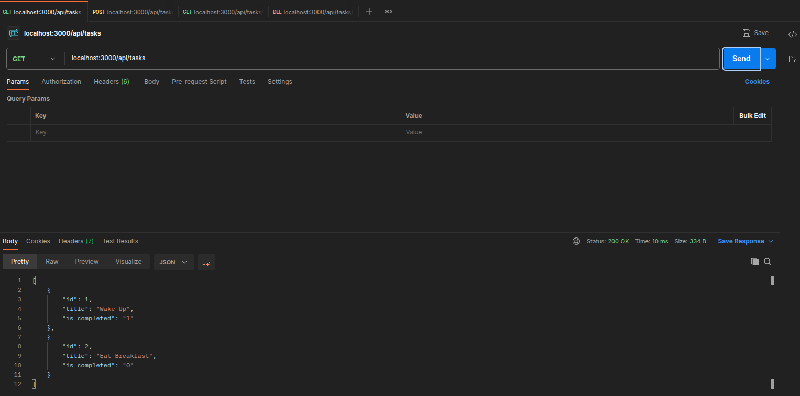
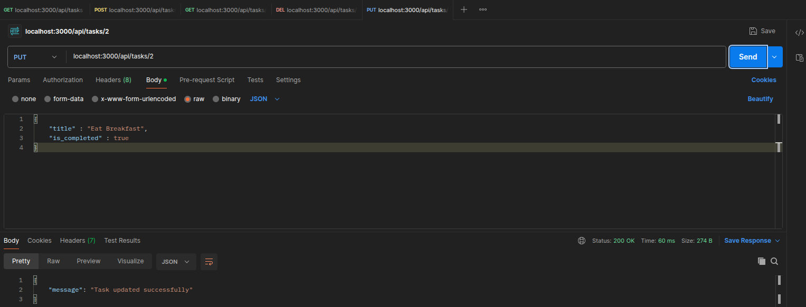
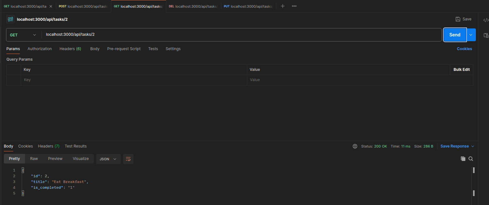
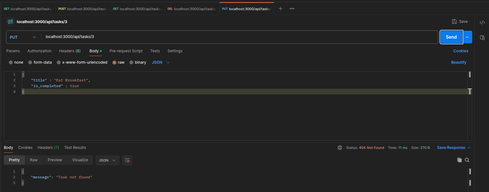

Formative API for Web Development classes
Built using Node.JS and Express

Here are screenshot of the working APIs:

Below is the get all API before creating a new object

As seen here, 1 represents True and 0 represents false as it is a boolean

Here is the screenshot of the new object being created successfully

As seen below with the get all student, object was added successfully

Here is the API to obtain only 1 task using the id

If the id does not exist, an error message is returned

Now let's delete the previous test task

It's no longer in the list

Let's attempt to delete it again

It's not here so you cannot delete it, 404, task not found

Now let's update the existing task, let's pretend I just ate breakfast

As we can see, is_completed in Task object with id=2 has changed from 0 to 1, from 'false' to 'true'

Attempting to modify non-existing task give us the error 404:

